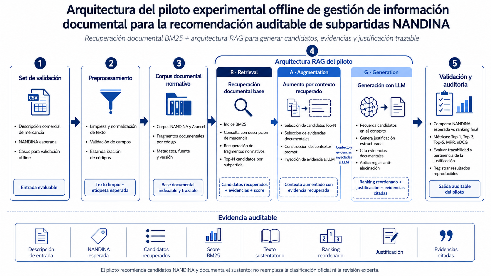

# Gestión de información documental para recomendación auditable de subpartidas NANDINA con LLM+RAG

Repositorio del piloto experimental offline de la investigación de maestría:

**Gestión de información documental para la recomendación auditable de subpartidas NANDINA mediante recuperación documental y LLM+RAG: piloto experimental offline.**

El proyecto organiza corpus normativo, recuperación documental y experimentos offline para apoyar la recomendación auditable de subpartidas NANDINA. No produce clasificación oficial ni reemplaza revisión experta.

## Estado de la Fase 1

Esta fase deja una base ejecutable y mínimamente reproducible. Los notebooks siguen disponibles como bitácora experimental, pero la lógica básica de corpus, BM25, recuperación y prueba mínima ya vive en `src/`.

## Metodología experimental

El experimento evalúa un pipeline offline de recuperación documental para recomendación auditable de subpartidas NANDINA a ocho dígitos. A partir de un set de validación con dos columnas (`descripcion`, `nandina`), el sistema verifica si la subpartida esperada puede recuperarse desde la descripción comercial de la mercancía dentro de un ranking de candidatos.

La columna `descripcion` contiene el texto comercial consolidado de la mercancía. En escenarios basados en DAM, esta descripción puede construirse mediante la concatenación de los cinco campos descriptivos de cada serie. La columna `nandina` contiene el código esperado, normalizado al formato NANDINA-8, y se utiliza únicamente como referencia de validación.

El flujo experimental es el siguiente:

1. **Set de validación**: se carga un archivo CSV con descripciones comerciales y códigos NANDINA esperados.
2. **Preprocesamiento**: se limpian y normalizan las descripciones; los códigos se validan en formato de ocho dígitos.
3. **Corpus NANDINA**: se utiliza un corpus documental curado con registros tipo `nandina_8`, asociados a texto normativo o descriptivo.
4. **Índice BM25**: se construye o carga un índice léxico BM25 (`bm25_nandina8.pkl`) sobre los documentos NANDINA-8.
5. **Recuperación de candidatos**: para cada descripción, BM25 recupera candidatos ordenados por puntaje, generando un ranking TOP-N con código, score y texto sustentatorio.
6. **Reescritura controlada con LLM**: opcionalmente, un LLM local vía Ollama (`llama3.1:8b`) reescribe la consulta para una segunda pasada BM25. El LLM no clasifica la mercancía ni decide la subpartida final; solo apoya la reformulación de la consulta bajo reglas anti-deriva.
7. **Validación y auditoría**: la NANDINA esperada se compara contra el ranking recuperado mediante métricas como Acc@1, Acc@3, Acc@5, Acc@10 y MRR. La corrida registra resultados, consultas, candidatos, scores, parámetros y hashes para trazabilidad.

La salida del experimento permite responder si la NANDINA esperada aparece dentro de los primeros candidatos recuperados y con qué evidencia textual fue sustentada. El sistema recomienda candidatos NANDINA y documenta el sustento; no produce clasificación oficial ni reemplaza la revisión experta.

### Pipeline general



## Estructura

```text
.
├── data/
│   ├── raw/                  # PDFs fuente locales
│   └── processed/            # corpus, índices y artefactos regenerables
├── docs/                     # documentación metodológica
├── notebooks/                # exploración y experimentos originales
├── outputs/                  # salidas generadas
├── src/
│   ├── bm25_index.py         # índice BM25 compatible con notebooks y pickles previos
│   ├── corpus/               # preparación de campos de corpus para recuperación
│   ├── retrieval/            # carga y consulta de índices
│   ├── experiments/          # scripts ejecutables
│   ├── evaluation/           # métricas mínimas
│   └── utils/                # rutas y configuración
├── requirements.txt
└── README.md
```

## Instalación

Desde la raíz del repositorio:

```powershell
cd "C:\Users\Vladimir\OneDrive\Documentos\Maestría UNMSM\LLM_RGA_NANDINA"
py -m venv .venv
.\.venv\Scripts\Activate.ps1
python -m pip install --upgrade pip
python -m pip install -r requirements.txt
```

Si el proyecto se ejecuta desde otra ruta, puede fijarse la raíz con:

```powershell
$env:NANDINA_PROJECT_ROOT = "C:\ruta\al\repo"
```

## Configuración

La configuración principal está en:

```text
src/configs/experiment_config.json
```

Las rutas son relativas a la raíz del repositorio por defecto. Esto evita depender de rutas absolutas locales.

El snapshot metodológico oficial de la Fase 2A queda congelado en:

```text
src/configs/experiment_v0.1.json
```

Su protocolo corto asociado está en `docs/protocolo_experimental_v0.1.md`. El archivo `experiment_config.json` se mantiene como configuración operativa.

## Reconstruir o usar el corpus

Si ya existe `data/processed/corpus_rag_v1_index.jsonl`, puede usarse directamente para BM25.

Para regenerar el campo `texto_index` a partir del corpus curado:

```powershell
python -m src.corpus.text_index
```

Entrada por defecto:

```text
data/processed/corpus_rag_v1.jsonl
```

Salida por defecto:

```text
data/processed/corpus_rag_v1_index.jsonl
```

## Construir índice BM25

Para reconstruir el índice NANDINA-8:

```powershell
python -m src.experiments.build_bm25_index
```

Salida por defecto:

```text
data/processed/indexes/bm25_nandina8.pkl
data/processed/indexes/bm25_nandina8_run_metadata.json
```

El índice conserva compatibilidad con los notebooks que importan `bm25_index.BM25Index`.

## Cargar índice y ejecutar una prueba mínima

Con el índice existente o reconstruido:

```powershell
python -m src.experiments.smoke_test --query "computadora portátil con procesador y memoria" --top-n 5
```

El comando imprime los códigos NANDINA recuperados, puntajes BM25 y fragmentos de texto.

## Notebooks de referencia

Los notebooks existentes documentan el desarrollo original:

- `01_Construccion_Corpus_NANDINA.ipynb`
- `02_Construccion_Corpus_Arancel2022_RGI_Notas.ipynb`
- `03_Curacion_Corpus_RAG.ipynb`
- `04_BM25_Indexacion_NANDINA.ipynb`
- `05_BM25_2Pasadas_LLM_Rewrite_Evaluacion.ipynb`
- `05_Text2Trade_Indexacion_NANDINA.ipynb`

## Política de artefactos

No subir modelos pesados, PDFs grandes ni artefactos regenerables nuevos sin decisión explícita. Algunos artefactos ya estaban versionados al iniciar esta fase; no se movieron ni eliminaron.

## Alcance

La Fase 1 no ejecuta evaluación final ni amplía dataset. El objetivo es reproducibilidad mínima: preparar corpus indexable, construir/cargar BM25 y ejecutar una consulta de humo.

## Dataset de evaluación final

El archivo `data/processed/devset_validacion_intermedia.csv` queda como devset preliminar de 13 casos para desarrollo, validación intermedia y smoke tests; no debe ampliarse ni mezclarse con la evaluación final.

El evalset final se construirá por separado como `data/processed/evalset_v0.1.csv`, con tamaño objetivo aproximado de 300 instancias y trazabilidad mínima por caso. El protocolo, la ficha y la plantilla están en `docs/protocolo_dataset_evaluacion_v0.1.md`, `docs/ficha_dataset_evaluacion_v0.1.md` y `docs/templates/evalset_v0.1_template.csv`.

La ingesta desde un Excel o CSV preparado por el usuario se realiza con `python -m src.evaluation.build_evalset_from_sunat_excel`; la guia de preparacion esta en `docs/guia_preparacion_excel_sunat_v0.1.md`.
